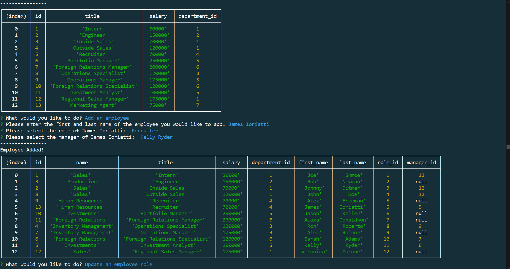

# Employee-Tracker

An application that allows the user to create, manage, and store company information in a persistant database. Company information includes employees, their roles, a roles respective department, and identification numbers.
This application was created using node.js and mysql.

[Video Walkthrough](https://drive.google.com/file/d/17Jao6CIfD6ObZC_0Dis3jeSvfg3dfEm0/view)

